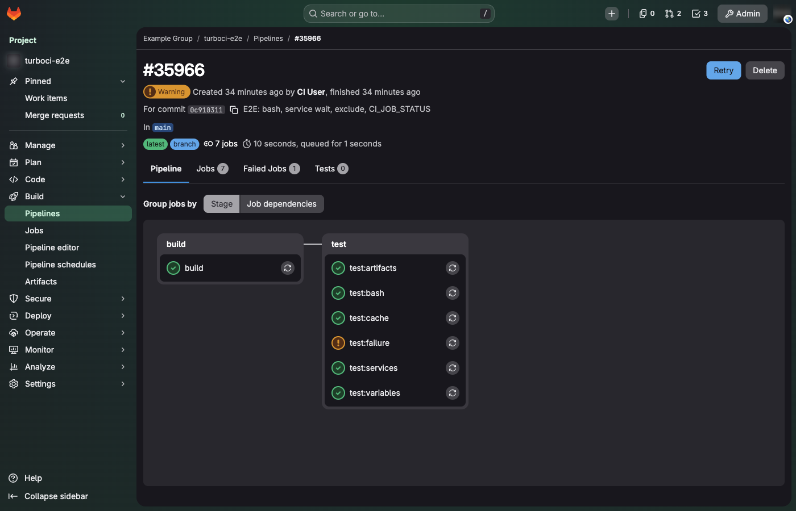
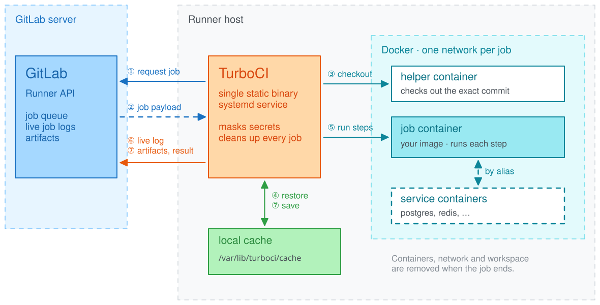
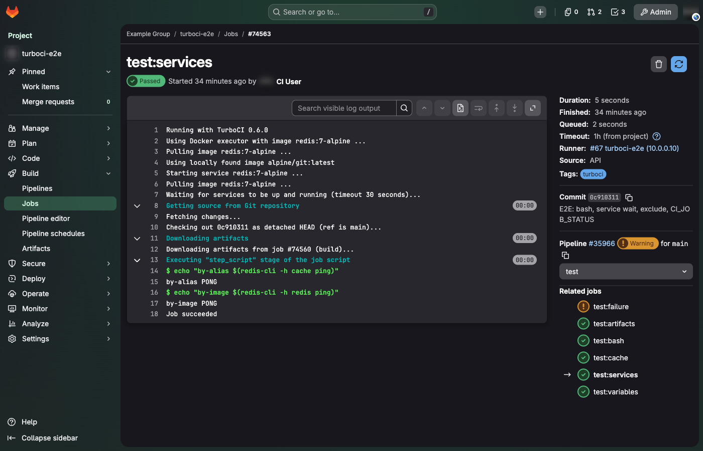

# TurboCI

[](https://github.com/ismoilovdevml/turboci/actions/workflows/ci.yml)
[](https://github.com/ismoilovdevml/turboci/releases)
[](https://ismoilovdevml.github.io/turboci/)
[](LICENSE)

TurboCI is a GitLab CI/CD runner written in Rust. It talks to GitLab's runner API like
[gitlab-runner](https://gitlab.com/gitlab-org/gitlab-runner) does, so your `.gitlab-ci.yml` runs
unchanged: each job runs in its own Docker container, or directly on the host with the shell
executor.

It is one static binary with no external services: no Redis, no database, no helper daemon.



## Why

- **Small:** an 11 MB static binary that uses about 11 MB of memory while idle, against 88 MB for
  gitlab-runner on the same host.
- **Drop-in:** artifacts, cache, `services`, `needs`, masked variables, cancellation and timeouts
  behave as on gitlab-runner. It can run next to gitlab-runner on the same host and Docker daemon
  without touching its containers.
- **Corporate networks:** HTTP proxy, a company CA for GitLab and registries, insecure registries
  for `docker:dind`, and a job cache shared between hosts through S3 (MinIO, Ceph, AWS).
- **Safe by default:** the runner runs as an unprivileged service user, secrets are masked in the
  log, and cache and artifact archives are extracted without following symlinks.

## How it works



The runner asks GitLab for a job whenever it has a free slot. A small helper container checks out
the pipeline's exact commit, so job images need no `git`. The cache and earlier jobs' artifacts are
restored, the steps run in the job container next to its services, and the log streams to GitLab
with secrets masked. At the end artifacts are uploaded, the cache is saved and every container and
network of the job is removed.

## Getting started

Create a runner in GitLab (**Settings → CI/CD → Runners → New project runner**, tag `turboci`),
then install, register and start it with one command:

```bash
curl -sSL https://raw.githubusercontent.com/ismoilovdevml/turboci/main/install.sh \
  | sudo bash -s -- --url https://gitlab.example.com --token glrt-XXXX
```

The installer checks the binary against the release's `SHA256SUMS`, installs Docker if needed,
creates the `turboci` service user and systemd unit, and waits until the runner is online.

Then send a job to the runner's tag:

```yaml
test:
  tags: [turboci]
  image: node:22
  services: [postgres:16]
  script:
    - npm test
```



## Documentation

The documentation is at **[ismoilovdevml.github.io/turboci](https://ismoilovdevml.github.io/turboci/)**:

- [Installation](https://ismoilovdevml.github.io/turboci/installation/): installer options, manual install, uninstall
- [Connecting to GitLab](https://ismoilovdevml.github.io/turboci/gitlab/): creating the runner and its token
- [Configuration](https://ismoilovdevml.github.io/turboci/configuration/): Docker, shell, proxy, registries, S3 cache
- [Pipeline support](https://ismoilovdevml.github.io/turboci/pipelines/): what works and what does not yet
- [Operations](https://ismoilovdevml.github.io/turboci/operations/): upgrades, shutdown, logs, troubleshooting

## Status

TurboCI runs the CI of a team's projects in production on a self-hosted GitLab 19 instance, next
to gitlab-runner on the same host. Release binaries are built for x86_64 and aarch64 Linux, and
macOS on Apple Silicon.

Not supported yet: Kubernetes and autoscaling executors, Windows jobs, interactive web
terminals, Vault secrets and Docker credential helpers. GitLab never sends a job that needs a
missing feature to a runner that does not report it.

## Development

You need a stable Rust toolchain; the Docker tests also need a Docker daemon.

```bash
git clone https://github.com/ismoilovdevml/turboci
cd turboci
cargo build --release --features runner
cargo test --all-features                  # unit tests
cargo test --all-features -- --ignored     # Docker and MinIO integration tests
```

| Directory | |
|---|---|
| `src/gitlab` | GitLab runner API client |
| `src/runner_daemon` | job loop, executors, checkout, cache, artifacts, S3 |
| `install.sh`, `uninstall.sh` | host installer and uninstaller |
| `e2e/` | end-to-end pipeline run against a real GitLab |
| `docs/` | the documentation site |

## License

MIT, see [LICENSE](LICENSE).
