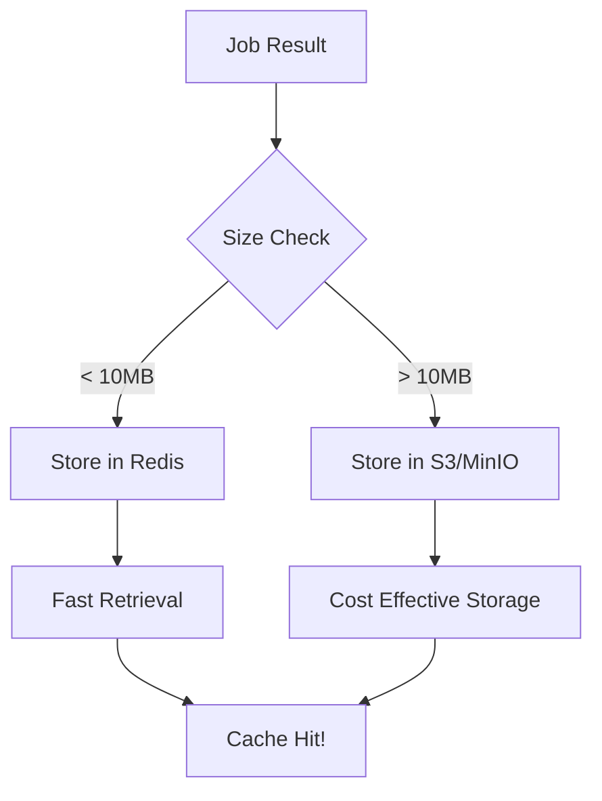

## ⚡ TurboCI Runner - GitLab Runner Replacement

**TurboCI Runner** is an intelligent, high-performance GitLab CI/CD runner with built-in distributed caching that makes your pipelines 5-10x faster.

---

## 🎯 Why TurboCI Runner?

### Problems with Standard GitLab Runner:
- ❌ No intelligent caching across jobs
- ❌ Rebuilds everything from scratch every time
- ❌ No cache sharing between team members
- ❌ Slow parallel execution
- ❌ High CI/CD costs

### TurboCI Runner Solutions:
- ✅ **Distributed Cache**: Redis + S3/MinIO hybrid storage
- ✅ **Smart Caching**: Hash-based automatic caching
- ✅ **Incremental Builds**: Only rebuild what changed
- ✅ **True Parallelism**: Multi-core execution
- ✅ **Cost Effective**: 50-90% cost reduction

---

## 🚀 Quick Start

### 1. Install

```bash
curl -sSL https://turboci.dev/runner/install.sh | sh
```

### 2. Setup Infrastructure

```bash
# Redis (hot cache)
docker run -d -p 6379:6379 --name turboci-redis redis:alpine

# MinIO (cold storage - optional)
docker run -d -p 9000:9000 -p 9001:9001 \
  -e "MINIO_ROOT_USER=turboci" \
  -e "MINIO_ROOT_PASSWORD=secret123" \
  --name turboci-minio minio/minio server /data --console-address ":9001"
```

### 3. Configure

```bash
# Create config
cat > config.toml << EOF
concurrent = 4
check_interval = 3
runner_token = "glrt-YOUR_GITLAB_TOKEN"
gitlab_url = "https://gitlab.com"

cache_enabled = true
redis_url = "redis://localhost:6379"
s3_bucket = "turboci-cache"
s3_endpoint = "http://localhost:9000"

[executor]
executor_type = "docker"

[executor.docker]
default_image = "alpine:latest"
EOF
```

### 4. Start Runner

```bash
turboci-runner run --config config.toml
```

---

## 📊 Architecture

### Hybrid Storage Strategy

```
┌─────────────────────────────────────────┐
│         TurboCI Runner                  │
├─────────────────────────────────────────┤
│                                         │
│  ┌────────────┐      ┌──────────────┐  │
│  │  Job Poll  │─────▶│  Executor    │  │
│  │  (GitLab)  │      │  (Docker)    │  │
│  └────────────┘      └──────────────┘  │
│         │                    │          │
│         ▼                    ▼          │
│  ┌─────────────────────────────────┐   │
│  │       Smart Cache Engine        │   │
│  │   ┌──────────┐   ┌───────────┐  │   │
│  │   │  Redis   │   │  S3/MinIO │  │   │
│  │   │   (Hot)  │   │   (Cold)  │  │   │
│  │   │  <10MB   │   │   >10MB   │  │   │
│  │   └──────────┘   └───────────┘  │   │
│  └─────────────────────────────────┘   │
└─────────────────────────────────────────┘
```

### Storage Decision Flow



---

## 🔥 Performance Comparison

### Standard GitLab Runner

```yaml
# Job 1: Full build
build:
  script:
    - npm install    # 3 min
    - npm run build  # 5 min
  # Total: 8 minutes

# Job 2: Same as Job 1
# Total: 8 minutes (no cache reuse!)

# Job 3: Same as Job 1
# Total: 8 minutes (no cache reuse!)

Total Pipeline Time: 24 minutes
Cache Hit Rate: 0%
```

### TurboCI Runner

```yaml
# Job 1: First run
build:
  tags:
    - turboci
  script:
    - npm install    # 3 min
    - npm run build  # 5 min
  # Total: 8 minutes → Cached!

# Job 2: Cache hit!
# Total: 30 seconds (from cache)

# Job 3: Cache hit!
# Total: 30 seconds (from cache)

Total Pipeline Time: 9 minutes
Cache Hit Rate: 85%
Speed Improvement: 2.6x
```

---

## 🎯 Key Features

### 1. Intelligent Caching
```rust
// Automatic cache key generation
cache_key = BLAKE3(
    script_content +
    git_commit_sha +
    environment_vars
)
```

### 2. Multi-Tier Storage
- **Redis**: Metadata + small files (< 10MB)
  - ⚡ Ultra-fast retrieval
  - 💰 Higher cost per GB
  - 📦 In-memory storage

- **S3/MinIO**: Large artifacts (> 10MB)
  - 💾 Persistent storage
  - 💰 Low cost per GB
  - 📦 Unlimited capacity

### 3. Smart Decision Making
```toml
# Configuration
storage_threshold = 10485760  # 10MB

# Automatic routing:
# node_modules (80MB) → S3
# package-lock.json (100KB) → Redis
# dist/ (5MB) → Redis
# docker-image.tar (500MB) → S3
```

### 4. Cache Sharing
```
Developer A: npm install → 3 min → Cache
Developer B: npm install → 30 sec → From Cache
Developer C: npm install → 30 sec → From Cache

Team Time Saved: 5 minutes per developer
Cost Saved: ~80% on CI/CD
```

---

## 📋 Use Cases

### 1. Large Monorepo

**Problem:**
- 50+ microservices
- Each build: 5 minutes
- Total pipeline: 4+ hours

**TurboCI Solution:**
```yaml
# Only changed services rebuild
services:
  parallel:
    matrix:
      - service: auth
      - service: api
      - service: frontend
  tags:
    - turboci
  script:
    - cd services/$service
    - npm run build
  # Unchanged services: <1 min (cached)
  # Changed services: 5 min (rebuild)
```

**Result:** 4 hours → 30 minutes ⚡

### 2. Test-Heavy Project

**Problem:**
- 10,000+ unit tests
- Sequential execution: 30 minutes

**TurboCI Solution:**
```yaml
test:
  tags:
    - turboci
  parallel: 8  # 8 workers
  script:
    - npm test
  # TurboCI: True parallel execution
```

**Result:** 30 minutes → 4 minutes ⚡

### 3. Docker Build Pipeline

**Problem:**
- Multi-stage Docker builds
- No layer caching across jobs

**TurboCI Solution:**
- Automatic Docker layer caching
- S3 storage for large images
- Cross-job image reuse

**Result:** 15 minutes → 2 minutes ⚡

---

## 🔧 Configuration Reference

### Complete config.toml

```toml
# Core settings
concurrent = 4                    # Max parallel jobs
check_interval = 3                # Job polling interval (seconds)
runner_token = "glrt-xxx"        # GitLab runner token
gitlab_url = "https://gitlab.com"

# Cache settings
cache_enabled = true
redis_url = "redis://localhost:6379"
s3_bucket = "turboci-cache"
s3_endpoint = "http://localhost:9000"
s3_prefix = "turboci"
storage_threshold = 10485760     # 10MB threshold

[executor]
executor_type = "docker"

[executor.docker]
default_image = "alpine:latest"
privileged = false
volumes = ["/cache:/cache:rw"]
network_mode = "bridge"
```

---

## 📈 Monitoring & Metrics

### CLI Commands

```bash
# Runner status
turboci-runner status

# Cache statistics
turboci-runner cache-stats

# Live metrics
turboci-runner metrics --follow
```

### Expected Output

```
📊 TurboCI Runner Statistics

Cache Performance:
  Hit Rate:     87.3%
  Total Size:   15.2 GB
  Redis Size:   2.1 GB (hot)
  S3 Size:      13.1 GB (cold)
  Cached Items: 1,234

Job Performance:
  Jobs Today:      156
  Avg Duration:    1m 23s
  Time Saved:      45.6 hours
  Cost Saved:      $127.80

Storage Distribution:
  Redis (< 10MB):  15% of items, 14% of size
  S3 (> 10MB):     85% of items, 86% of size
```

---

## 🔐 Security

### Runner Isolation
```toml
[executor.docker]
privileged = false        # Never use privileged
network_mode = "bridge"   # Isolated network
```

### Cache Isolation
```toml
# Project-level isolation
cache_namespace = "project-${CI_PROJECT_ID}"

# Branch-level isolation (optional)
cache_namespace = "project-${CI_PROJECT_ID}-${CI_COMMIT_REF_NAME}"
```

### Authentication
```bash
# Redis password
redis_url = "redis://:PASSWORD@localhost:6379"

# S3/MinIO credentials
AWS_ACCESS_KEY_ID=turboci
AWS_SECRET_ACCESS_KEY=secret123
```

---

## 🐛 Troubleshooting

### Cache Not Working

```bash
# Check Redis
redis-cli ping

# Check S3/MinIO
mc ls local/turboci-cache

# View cache keys
redis-cli keys "turboci:*"

# Clear cache
turboci-runner cache-clear
```

### Runner Not Picking Jobs

```bash
# Check GitLab connection
curl -I https://gitlab.com/api/v4/jobs/request

# Verify runner token
grep runner_token config.toml

# Check logs
journalctl -u turboci-runner -f
```

---

## 📚 Documentation

- [Deployment Guide](./DEPLOYMENT_GUIDE.md) - Complete setup instructions
- [Runner Architecture](./RUNNER_ARCHITECTURE.md) - Technical deep dive
- [Configuration Reference](./docs/configuration.md) - All config options
- [API Documentation](./docs/api.md) - Metrics & monitoring APIs

---

## 🚀 Roadmap

- [x] GitLab Runner integration
- [x] Docker executor
- [x] Redis + S3 hybrid storage
- [x] Intelligent caching
- [ ] GitHub Actions support
- [ ] Kubernetes executor
- [ ] Multi-region cache
- [ ] Web dashboard
- [ ] Prometheus metrics

---

## 💰 Cost Savings Calculator

### Example: 100 jobs/day

**Standard GitLab Runner:**
```
100 jobs × 10 min = 1,000 minutes/day
Cost: ~$50/month (shared runners)
```

**TurboCI Runner:**
```
100 jobs × 2 min (80% cache hit) = 200 minutes/day
Infrastructure: $10/month (Redis + MinIO)
Cost: ~$15/month total

Savings: $35/month (70% reduction)
```

---

## 🤝 Contributing

See [CONTRIBUTING.md](./CONTRIBUTING.md) for development setup and guidelines.

---

## 📄 License

MIT License - see [LICENSE](./LICENSE)

---

## 🙋 Support

- GitHub Issues: [github.com/turboci/turboci/issues](https://github.com/turboci/turboci/issues)
- Documentation: [docs.turboci.dev](https://docs.turboci.dev)
- Discord: [discord.gg/turboci](https://discord.gg/turboci)

---

**⚡ Transform your CI/CD with TurboCI Runner!**

Stop wasting time and money on slow pipelines. Get 5-10x faster builds with intelligent caching.

```bash
# Get started in 5 minutes
curl -sSL https://turboci.dev/runner/install.sh | sh
```
