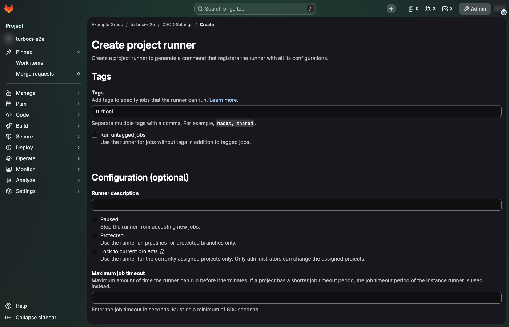
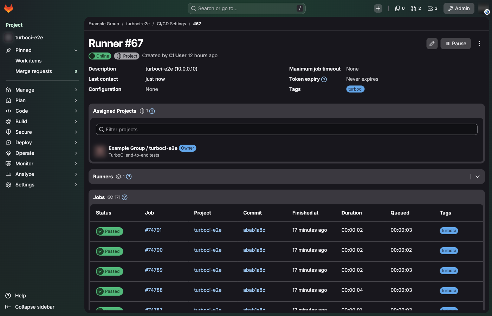
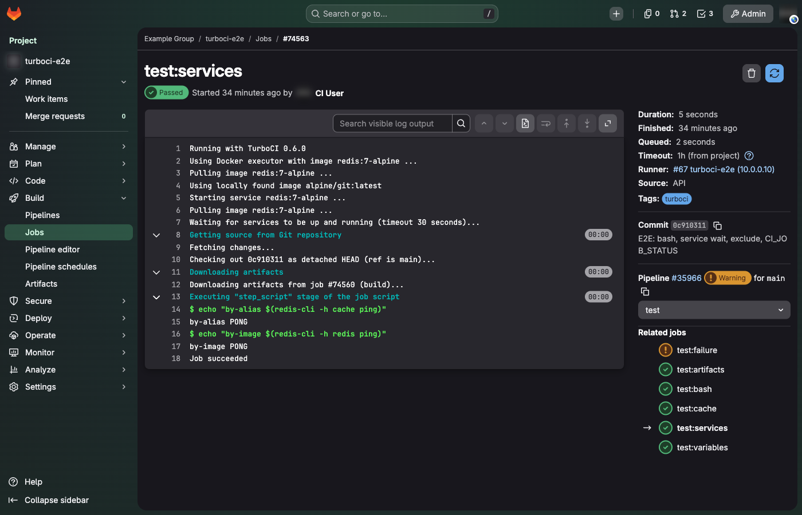

# Connecting to GitLab

TurboCI uses GitLab's runner authentication tokens (`glrt-...`), the workflow
GitLab has used since 15.10. Registration tokens are not supported.

## Create a runner

Pick the scope the runner should serve:

=== "Project"

    **Settings → CI/CD → Runners → New project runner**. Only this project's
    jobs run on it.

=== "Group"

    **Build → Runners → New group runner** on the group. Every project in the
    group can use it. Needs the Owner role on the group.

=== "Instance"

    **Admin → CI/CD → Runners → New instance runner**. Every project can use
    it. Needs an administrator.

On the form:

- **Tags**: add a tag such as `turboci`. Jobs choose the runner with
  `tags: [turboci]`.
- **Run untagged jobs**: leave it off unless TurboCI should also take jobs
  without tags.
- **Maximum job timeout** (optional): caps the timeout of jobs on this runner.

Click **Create runner** and copy the token shown in step 1 (it starts with
`glrt-`). The `gitlab-runner register` command on that page is not needed.



!!! tip "Creating runners with the API"
    Runners can also be created with a personal access token that has the
    `create_runner` scope:

    ```bash
    curl -s -X POST -H "PRIVATE-TOKEN: $PAT" "https://gitlab.example.com/api/v4/user/runners" \
      -d runner_type=project_type -d project_id=42 -d tag_list=turboci -d run_untagged=false \
      | jq -r .token
    ```

## Install and register

```bash
curl -sSL https://raw.githubusercontent.com/ismoilovdevml/turboci/main/install.sh \
  | sudo bash -s -- --url https://gitlab.example.com --token glrt-XXXX
```

After a few seconds the runner is **Online** under **Settings → CI/CD →
Runners**, and its page lists the jobs it ran:



To change the token or URL later, edit `/etc/turboci-runner.toml` and run
`sudo systemctl restart turboci`, or run the installer again with `--token`.

## Use it in a pipeline

Point jobs at the runner with its tag:

```yaml
default:
  tags: [turboci]

build:
  image: rust:1.82
  script:
    - cargo build --release
  cache:
    key: $CI_COMMIT_REF_SLUG
    paths: [target/]
  artifacts:
    paths: [target/release/app]

test:
  image: rust:1.82
  needs: [build]
  services:
    - name: postgres:16
      alias: db
  variables:
    POSTGRES_PASSWORD: ci
  script:
    - cargo test
```

The job log starts with `Running with TurboCI <version>`, and each phase
(sources, cache, script, artifacts) is a collapsible section:



## GitLab with a self-signed or internal certificate

Give the installer the CA certificate (PEM) that signed GitLab's certificate:

```bash
curl -sSL https://raw.githubusercontent.com/ismoilovdevml/turboci/main/install.sh \
  | sudo bash -s -- --url https://gitlab.internal --token glrt-XXXX --tls-ca-file ./internal-ca.pem
```

The runner trusts it for API calls, and jobs get it as
`CI_SERVER_TLS_CA_FILE` and `GIT_SSL_CAINFO`, so `git` inside jobs trusts it
too. In an existing config, set `tls_ca_file = "/path/to/ca.pem"`.

## Runner token expiry

If the GitLab instance gives runner tokens an expiry, TurboCI renews the token
after three quarters of its lifetime, like gitlab-runner. See
[token rotation](operations.md#runner-token-rotation).

## Running next to gitlab-runner

TurboCI and gitlab-runner can share a host and a Docker daemon. TurboCI only
touches containers and networks it labels with its own system ID
(`turboci.runner=<id>`), named `turboci-job-*`. Give each runner its own tags
so a job is routed to the one you mean.
