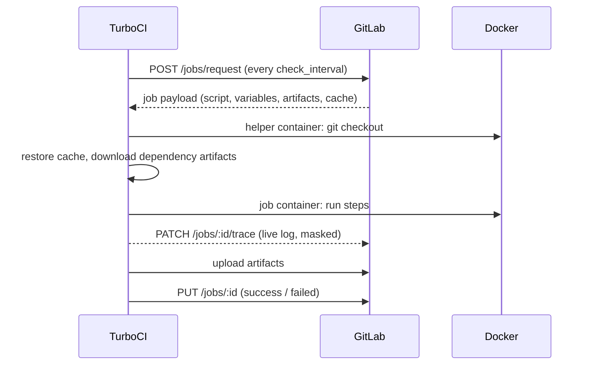

# TurboCI

TurboCI is a GitLab CI/CD runner written in Rust. It speaks GitLab's runner API
like [gitlab-runner](https://gitlab.com/gitlab-org/gitlab-runner) does, so it
runs your existing `.gitlab-ci.yml` jobs unchanged. It runs each job in a Docker
container (default) or directly on the host (shell executor).

It is one static binary (Linux x86_64, musl) with no external services: no
Redis, no database, no helper daemon.

- **Install with one command**

    Downloads a checksum-verified release, creates a systemd service and
    registers with GitLab. [Installation →](installation.md)

- **Drop-in for GitLab jobs**

    Artifacts, cache, services, `needs`, masked variables, cancellation and
    timeouts behave as on gitlab-runner. [Pipeline support →](pipelines.md)

- **Small footprint**

    11 MB of memory while idle against 88 MB for gitlab-runner, and 19%
    faster pipelines on the same host. [Benchmarks →](benchmarks.md)

## How it works

1. The runner asks GitLab for a job whenever it has a free slot (`concurrent`).
2. Sources are checked out by a small helper container, so job images need no
   `git`.
3. Cache and dependency artifacts are restored into the workspace.
4. Each step (`before_script` + `script`, then `after_script`) runs in the job
   container; output streams to GitLab with secrets masked.
5. Artifacts and cache are saved, the result is reported, and every container,
   network and workspace of the job is removed.

## Status

TurboCI runs in production on a self-hosted GitLab 19 instance, next to
gitlab-runner on the same host.
Things it does not do yet are listed under
[not supported](pipelines.md#not-supported); GitLab never sends such jobs to a
runner that does not advertise the feature.
